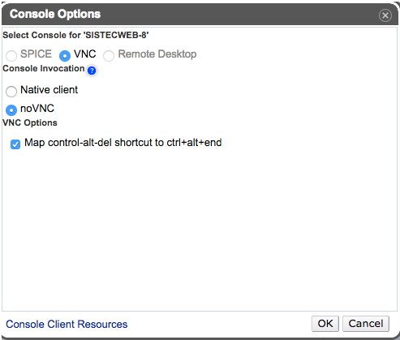

# Conversor de temperatura desplegado en IAAS
Conversor de temperaturas hecho con javascript como práctica para la asignatura de Sistemas y Tecnologías Web de Ingeniería Informática en la Universidad de La Laguna.

###La práctica consiste en:
Siguiendo las instrucciones en el repositorio despliegue la práctica anterior Karma, Travis y Web Workers en su máquina virtual del servicio iaas.ull.es. Si no ha usado Sinon.JS en la práctica anterior añada pruebas de mocking con Sinon.JS. Añada en el README.md un pequeño tutorial de como usar y desplegar una aplicación web en iaas.ull.es.

###Enlaces de interes: 
Repo: https://github.com/OscarTrujillo/temperatura_iaas

Git page de la tarea: http://oscartrujillo.github.io/temperatura_iaas/

Mi git page: http://oscartrujillo.github.io

Página desplegada en IAAS: http://10.6.128.82:8080/index.html

Travis: 

##Tutorial:
Lo primero que debemos de hacer es entrar al sistema IAAS desde su página web:
http://iaas.ull.es/ovirt-engine/

Nos loguearemos con nuestro alu0100... y la respectiva contraseña y ya estaremos dentro del sistema.

Una vez dentro nos encontraremos con una máquina linux y lo que deberemos hacer es configurar el visor VNC como muestra la siguiente imagen:

Y estamos listos para usar nuestra máquina, la inciamos y dentro nos loguearemos con:

+Usuario: usuario
+Contraseña: usuario

El sistema atomáticamente te pedirá que ingreses una nueva contraseña personal.
Una vez introducida ya estamos dentro.

Ahora lo aconsejable es seguir usando nuestra máquina desde una terminal de nuestra máquina física para más comodidad. 

    $ ssh usuario@"DIRECCIÓN_IP de la máquina"

El siguiente paso será instalar npm y nodejs

    $ sudo apt-get install npm
    $ sudo apt-get install nodejs
  
Ya estamos listos para clonar nuestro repositorio. 

    $ git clone <URL>

Instalamos dependencias:

    & npm install

Una vez lo tengamos listo modificaremos la siguiente línea del código de nuestro *static_server.js* :

    console.log("Visit http://<DIRECCIÓN_IP>:8080/index.html")

Y ejecutamos:

    $ sudo nodejs static_server.js
    
Ya tendremos nuestra aplicación desplegada en IASS, para comprobarlo entramos a:

    http://"DIECCIÓN_IP":8080/index.html

